# SWAMS — Database Design & ERD

PostgreSQL (Supabase). All primary keys are `UUID` (`gen_random_uuid()`, via
the `pgcrypto`/`pgcrypto` extension already enabled on Supabase) rather than
sequential integers — this avoids leaking row counts / organization sizes
across a multi-tenant system and avoids ID enumeration attacks on a public
API. Every tenant-scoped table carries `organization_id` even where it is
reachable transitively through a FK, per the brief's explicit requirement —
this also lets every query filter on `organization_id` directly, which is
what the tenant-isolation middleware and RLS policies key on.

---

## 1. Entity Relationship Diagram

```mermaid
erDiagram
    ORGANIZATION ||--o{ BRANCH : has
    ORGANIZATION ||--o{ DEPARTMENT : has
    ORGANIZATION ||--o{ SHIFT : defines
    ORGANIZATION ||--o{ USER_ACCOUNT : has
    ORGANIZATION ||--o{ EMPLOYEE : employs
    ORGANIZATION ||--|| ATTENDANCE_RULE : configures
    ORGANIZATION ||--o{ SUBSCRIPTION : subscribes
    ORGANIZATION ||--o{ AUDIT_LOG : generates
    ORGANIZATION ||--o{ NOTIFICATION : receives
    ORGANIZATION ||--o{ LEAVE_REQUEST : has

    SUBSCRIPTION_PLAN ||--o{ SUBSCRIPTION : "priced as"

    USER_ACCOUNT ||--|| EMPLOYEE : "is a"
    USER_ACCOUNT ||--o{ LOGIN_HISTORY : has
    USER_ACCOUNT ||--o{ REFRESH_TOKEN : issues
    USER_ACCOUNT ||--o{ DEVICE : registers
    USER_ACCOUNT ||--o{ AUDIT_LOG : performs
    USER_ACCOUNT ||--o{ NOTIFICATION : receives
    USER_ACCOUNT ||--o{ SECURITY_EVENT : triggers

    DEPARTMENT ||--o{ EMPLOYEE : contains
    BRANCH ||--o{ EMPLOYEE : "assigned to"
    BRANCH ||--o{ ATTENDANCE : "location of"
    SHIFT ||--o{ EMPLOYEE : "assigned to"

    EMPLOYEE ||--o{ ATTENDANCE : records
    EMPLOYEE ||--o{ LEAVE_REQUEST : submits
    EMPLOYEE ||--o{ LEAVE_BALANCE : has
    EMPLOYEE ||--o{ MANAGER_ASSIGNMENT : "managed by"
    EMPLOYEE ||--o{ MANAGER_ASSIGNMENT : "manages (as manager)"

    LEAVE_TYPE ||--o{ LEAVE_REQUEST : categorizes
    LEAVE_TYPE ||--o{ LEAVE_BALANCE : tracks

    ORGANIZATION {
        uuid id PK
        string name
        string registration_number
        string email
        string phone
        string address
        string logo_url
        enum status
        uuid current_subscription_id FK
        timestamptz created_at
        timestamptz updated_at
    }

    SUBSCRIPTION_PLAN {
        uuid id PK
        string code
        string name
        int max_employees
        int max_branches
        decimal monthly_price
        jsonb features
        bool is_active
    }

    SUBSCRIPTION {
        uuid id PK
        uuid organization_id FK
        uuid plan_id FK
        enum status
        date start_date
        date expiry_date
        timestamptz created_at
    }

    BRANCH {
        uuid id PK
        uuid organization_id FK
        string name
        string address
        decimal latitude
        decimal longitude
        int radius_meters
        int gps_accuracy_limit_meters
        bool is_active
        timestamptz created_at
    }

    DEPARTMENT {
        uuid id PK
        uuid organization_id FK
        string name
        uuid parent_department_id FK
        timestamptz created_at
    }

    SHIFT {
        uuid id PK
        uuid organization_id FK
        string name
        time start_time
        time end_time
        bool crosses_midnight
        timestamptz created_at
    }

    ATTENDANCE_RULE {
        uuid id PK
        uuid organization_id FK
        jsonb working_days
        int late_threshold_minutes
        int early_departure_threshold_minutes
        int overtime_threshold_minutes
        timestamptz updated_at
    }

    USER_ACCOUNT {
        uuid id PK
        uuid organization_id FK "null for SUPER_ADMIN"
        string email
        string employee_number
        string password_hash
        enum role
        bool is_active
        bool must_change_password
        int failed_login_attempts
        timestamptz locked_until
        timestamptz last_login
        timestamptz created_at
    }

    EMPLOYEE {
        uuid id PK
        uuid organization_id FK
        uuid user_id FK
        string employee_number
        string first_name
        string last_name
        string phone
        string profile_picture_url
        uuid department_id FK
        uuid branch_id FK
        uuid shift_id FK
        string position
        date joining_date
        enum employment_status
        timestamptz created_at
    }

    MANAGER_ASSIGNMENT {
        uuid id PK
        uuid organization_id FK
        uuid manager_employee_id FK
        uuid department_id FK "nullable"
        uuid employee_id FK "nullable"
        timestamptz created_at
    }

    ATTENDANCE {
        uuid id PK
        uuid organization_id FK
        uuid employee_id FK
        uuid branch_id FK
        date attendance_date
        timestamptz check_in_time
        timestamptz check_out_time
        decimal check_in_latitude
        decimal check_in_longitude
        decimal check_in_accuracy
        string check_in_device_id
        bool check_in_is_mock
        decimal check_out_latitude
        decimal check_out_longitude
        decimal check_out_accuracy
        string check_out_device_id
        bool check_out_is_mock
        enum status
        int working_minutes
        int late_minutes
        int overtime_minutes
        timestamptz created_at
    }

    LEAVE_TYPE {
        uuid id PK
        uuid organization_id FK
        string name
        int default_annual_days
        bool requires_approval
    }

    LEAVE_REQUEST {
        uuid id PK
        uuid organization_id FK
        uuid employee_id FK
        uuid leave_type_id FK
        date start_date
        date end_date
        string reason
        enum status
        uuid approved_by FK
        timestamptz decided_at
        timestamptz created_at
    }

    LEAVE_BALANCE {
        uuid id PK
        uuid organization_id FK
        uuid employee_id FK
        uuid leave_type_id FK
        int year
        decimal allocated_days
        decimal used_days
    }

    NOTIFICATION {
        uuid id PK
        uuid organization_id FK "null for platform-level"
        uuid user_id FK
        string title
        string message
        enum category
        bool is_read
        timestamptz created_at
    }

    DEVICE {
        uuid id PK
        uuid user_id FK
        string device_id
        string device_name
        string platform
        string push_token
        timestamptz first_seen_at
        timestamptz last_seen_at
    }

    LOGIN_HISTORY {
        uuid id PK
        uuid organization_id FK
        uuid user_id FK
        string ip_address
        string device_info
        bool was_successful
        string failure_reason
        timestamptz created_at
    }

    REFRESH_TOKEN {
        uuid id PK
        uuid user_id FK
        string token_hash
        string device_id
        bool is_revoked
        timestamptz expires_at
        timestamptz created_at
    }

    SECURITY_EVENT {
        uuid id PK
        uuid organization_id FK "nullable"
        uuid user_id FK "nullable"
        enum event_type
        string description
        string ip_address
        jsonb metadata
        timestamptz created_at
    }

    AUDIT_LOG {
        uuid id PK
        uuid organization_id FK "nullable for platform actions"
        uuid user_id FK
        string action
        string description
        string ip_address
        string device_info
        timestamptz timestamp
    }
```



---

## 2. Table Notes & Rationale (deltas from the brief's field list)

The brief's field lists in §16 are the contract; the additions below are
the minimum needed for the RBAC/security/leave features requested elsewhere
in the brief, called out explicitly rather than silently added:

- **`SubscriptionPlan`** — added so "Manage subscription plans" (Super
  Admin permission) has somewhere to live; `Subscription.plan` in the
  brief becomes `plan_id` FK to this table, so plan pricing/limits are
  edited in one place, not per-organization.
- **`AttendanceRule`** — one row per organization holding the "Working
  days / start time / end time / late threshold" configuration described
  in §13 of the brief; kept as its own table (not columns on
  `Organization`) so it can later become per-branch without a migration
  of the `Organization` table.
- **`Shift`** — required by §14 (Shift Management); `Employee.shift_id`
  assigns a shift per employee.
- **`ManagerAssignment`** — required to make "Manager: view assigned
  employees / department reports" (Role 3) concrete; a manager can be
  scoped to a department, to specific employees, or both.
- **`LeaveType` / `LeaveBalance`** — the brief lists leave *types* as a
  fixed enum and asks to "track leave balance"; modeled as a table (not a
  hardcoded enum) so an org admin can add org-specific leave types, and
  `LeaveBalance` gives balance-tracking a real home instead of computing
  it ad hoc from request history every time.
- **`Device` / `LoginHistory` / `RefreshToken`** — required by §22
  ("Device tracking", "Session management", "Logout from all devices",
  "new device login" detection) — none of this is representable with the
  brief's core tables alone.
- **`SecurityEvent`** — separates system-detected anomalies (failed
  logins, lockouts, mock-GPS attempts, cross-tenant access attempts) from
  `AuditLog`'s "a user did X" entries, matching the brief's distinct
  Super Admin permissions "View system audit logs" vs. "View security
  events".
- **`Notification.category`** — an enum (`ATTENDANCE`, `LEAVE`,
  `SECURITY`, `SYSTEM`) so the three different notification audiences in
  §21 can be filtered without parsing free text.

`User` (brief) is named `UserAccount` here only to avoid clashing with
Django's built-in `auth.User` — `AUTH_USER_MODEL` will point at this table
(see Architecture doc §2.1); no field is renamed from the brief's list, all
are additive (`must_change_password`, `failed_login_attempts`,
`locked_until` — required by §"First Login Security" and the account-lockout
requirement in §22).

---

## 3. Constraints & Referential Integrity

- `UserAccount.email` unique **per organization** (`UNIQUE(organization_id,
  email)`), not globally unique — two different organizations may
  legitimately have an employee with the same email domain/account, and
  Super Admin accounts (`organization_id IS NULL`) are unique globally.
- `Employee.employee_number` unique per organization
  (`UNIQUE(organization_id, employee_number)`).
- `Attendance` has `UNIQUE(employee_id, attendance_date)` — one attendance
  row per employee per day (check-in and check-out both write to the same
  row), enforced at the DB level, not just application logic.
- All child tables' `organization_id` has a `CHECK`/trigger-free
  guarantee via application code that it matches the parent's
  `organization_id` (e.g., `Attendance.organization_id ==
  Employee.organization_id`) — belt-and-braces alongside the FK, verified
  in tests (§32).
- `ON DELETE`: tenant data uses `ON DELETE RESTRICT` on FKs into
  `Organization` (an org is suspended, never hard-deleted, to preserve
  audit trail — see `Organization.status` enum: `ACTIVE / SUSPENDED /
  TRIAL / CANCELLED`); intra-org FKs (e.g. `Employee.department_id`) use
  `ON DELETE SET NULL` or `ON DELETE RESTRICT` depending on whether the
  child can sensibly exist without the parent (an employee survives their
  department being deleted; a department cannot be deleted out from under
  active employees without reassignment — enforced by a pre-delete check
  in the service layer, giving a clear error message instead of a raw DB
  constraint violation).

---

## 4. Indexing Strategy

Every table above gets, at minimum:

- `organization_id` (btree) — the tenant filter is on almost every query.
- Composite indexes matching actual query shapes, notably:
  - `Attendance(organization_id, employee_id, attendance_date DESC)` —
    attendance history per employee.
  - `Attendance(organization_id, branch_id, attendance_date)` — daily
    branch dashboards.
  - `Attendance(organization_id, attendance_date, status)` — "who's
    present/late/absent today" dashboard cards.
  - `AuditLog(organization_id, timestamp DESC)` and
    `AuditLog(user_id, timestamp DESC)`.
  - `LoginHistory(user_id, created_at DESC)`.
  - `LeaveRequest(organization_id, employee_id, status)`.
  - `Notification(user_id, is_read, created_at DESC)`.
- Partial index `UserAccount(organization_id, locked_until) WHERE
  locked_until IS NOT NULL` for the (rare) account-lockout lookups.

`attendance_date` (not just `check_in_time`) is a stored, indexed column
precisely so date-range reports don't need a function index on
`DATE(check_in_time)`.

---

## 5. Row-Level Security (defense-in-depth, see Architecture §6.3)

Example policy shape (applied per tenant-scoped table):

```sql
ALTER TABLE attendance ENABLE ROW LEVEL SECURITY;

CREATE POLICY tenant_isolation ON attendance
  USING (organization_id = current_setting('app.current_org_id')::uuid);
```

The Django connection sets `app.current_org_id` at the start of every
request (via a lightweight `SET LOCAL` inside the request's transaction).
This does not replace Django-level filtering — it is the safety net if
application code ever ships a bug that forgets to filter.

---

## 6. Backup & Retention

- Supabase automated daily backups (point-in-time recovery on paid tiers)
  — confirm plan tier before production launch.
- `AuditLog` and `SecurityEvent`: retained a minimum of 12 months (align
  to customer contracts/compliance needs), archived (not deleted) beyond
  that via a scheduled job to a cold-storage table/export rather than
  deleted, since these tables are append-only and never truly "expire"
  for legal purposes.
- `Attendance`: retained indefinitely (it is payroll-adjacent data);
  partitioning (Architecture §10) keeps old partitions cheap to keep
  online.
